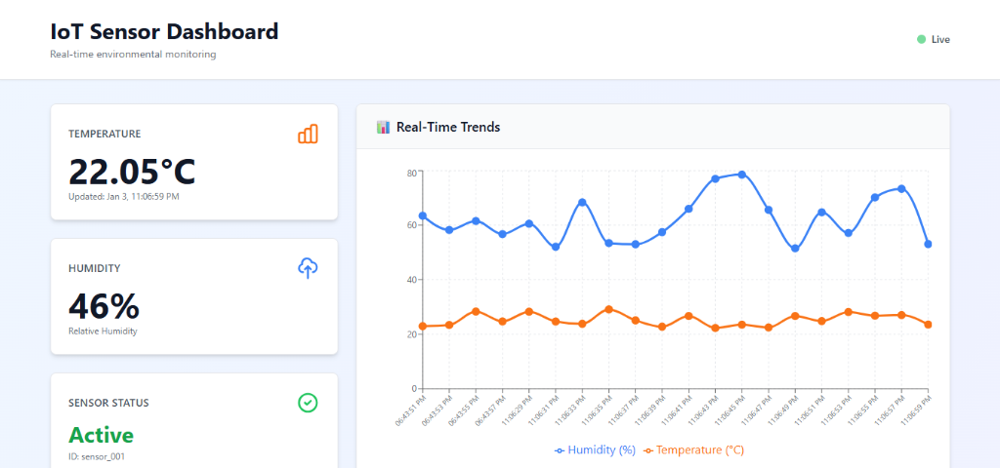
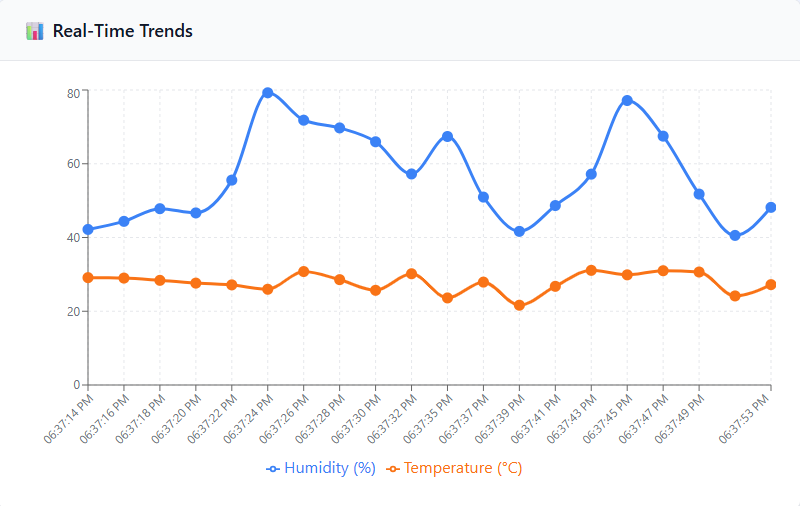
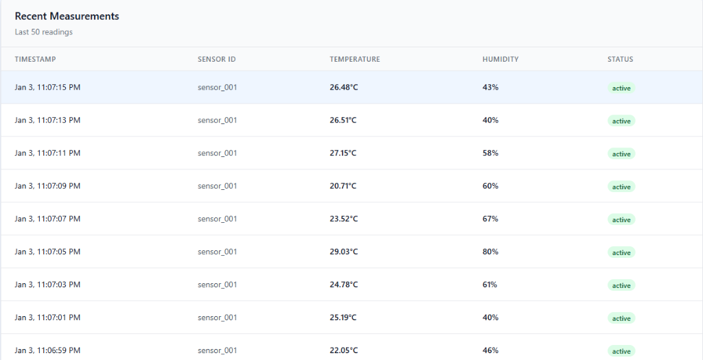

# Real-Time IoT Data Streamer

A complete full-stack application for real-time IoT sensor data streaming and visualization using MQTT, Node.js, and Next.js.

## 📋 Project Overview

This application demonstrates a real-time data pipeline that:
1. **Simulates IoT sensors** publishing environmental data (temperature, humidity)
2. **Processes and stores** incoming sensor data in a database
3. **Visualizes** the data in a modern, responsive web dashboard

### 🔴 Live Demo: [View Deployed App](https://iot-sensor-dashboard-psi.vercel.app/)

## 📸 Screenshots

### Dashboard Overview


### Real-Time Trends Chart


### Recent Measurements Log


## 🎥 Demo Video

[](https://www.youtube.com/watch?v=PLACEHOLDER_VIDEO_ID)

> *Video demonstration coming soon...*


## 🏗️ Architecture

- **Sensor Layer**: Python script (`sensor.py`) acting as an edge device, simulating real-world environmental readings and publishing them via MQTT.
- **Message Broker**: Uses the public `broker.emqx.io` for lightweight, real-time message routing.
- **Backend Service**: A Node.js & Express server that:
    - Subscribes to the MQTT topic (`intern-test/bhargav/sensor-data`).
    - Persists incoming data to a local SQLite database (`measurements` table).
    - Exposes a REST API (`/api/metrics`) for the frontend.
- **Frontend Dashboard**: A Next.js application using:
    - **Recharts** for real-time data visualization.
    - **Tailwind CSS** for responsive, modern UI.
    - **Client-Side Polling** to fetch the latest metrics every 2 seconds.

## 🚀 Tech Stack

- **Frontend**: Next.js 13+ (App Router), React, Tailwind CSS, Lucide React (Icons), Recharts
- **Backend**: Node.js, Express.js, SQLite3, MQTT.js
- **IoT Device**: Python 3, Paho MQTT Client
- **Infrastructure**: Docker connected via network bridging (optional)

## ⚡ Getting Started

### Prerequisites

- **Node.js**: v18 or higher
- **Python**: v3.8 or higher
- **Docker**: (Optional) For containerized deployment

### 📦 Installation & Running Locally

#### 1. Backend (API & Database)
```bash
cd backend
npm install
node server.js
```
*The server will start on port **5000** and automatically initialize `database.db`.*

#### 2. Frontend (Dashboard)
```bash
cd frontend
npm install
npm run dev
```
*The dashboard will be available at [http://localhost:3000](http://localhost:3000).*

#### 3. Start the Sensor
Open a new terminal to run the mock sensor:
```bash
cd sensor
pip install paho-mqtt
python sensor.py
```
*You should see logs indicating data is being pushed every few seconds.*

## 🐳 Running with Docker

This project includes Dockerfiles for each service.

1. **Build the images**:
   ```bash
   docker build -t iot-backend ./backend
   docker build -t iot-frontend ./frontend
   ```

2. **Run the containers**:
   ```bash
   docker run -d -p 5000:5000 --name backend iot-backend
   docker run -d -p 3000:3000 --link backend --name frontend iot-frontend
   ```

## 📂 Project Structure

```text
├── backend/
│   ├── Dockerfile
│   ├── server.js        # Main Express server & MQTT handler
│   └── database.db      # SQLite database (auto-generated)
├── frontend/
│   ├── app/             # Next.js App Router pages
│   ├── public/          # Static assets
│   └── Dockerfile
└── sensor/
    ├── sensor.py        # Python MQTT publisher
    └── Dockerfile
```

## ⚙️ Configuration

- **MQTT Topic**: Currently set to `intern-test/bhargav/sensor-data`. To change this, update both `sensor/sensor.py` and `backend/server.js`.
- **API URL**: The frontend defaults to `localhost:5000`. For production, set the `NEXT_PUBLIC_API_URL` environment variable.
